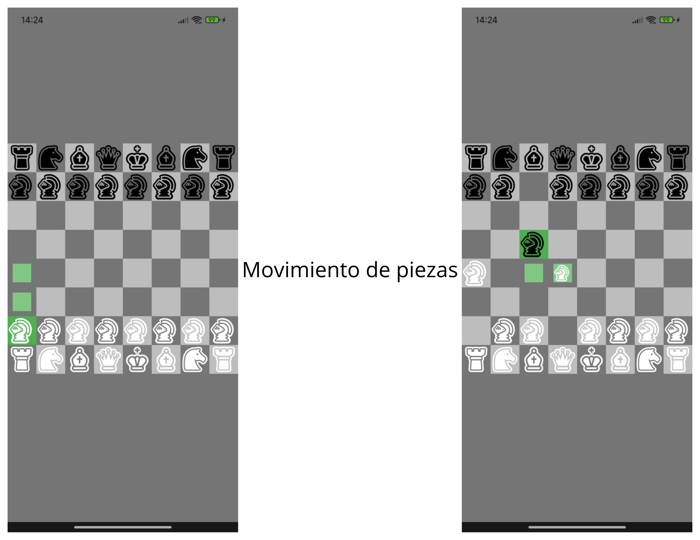
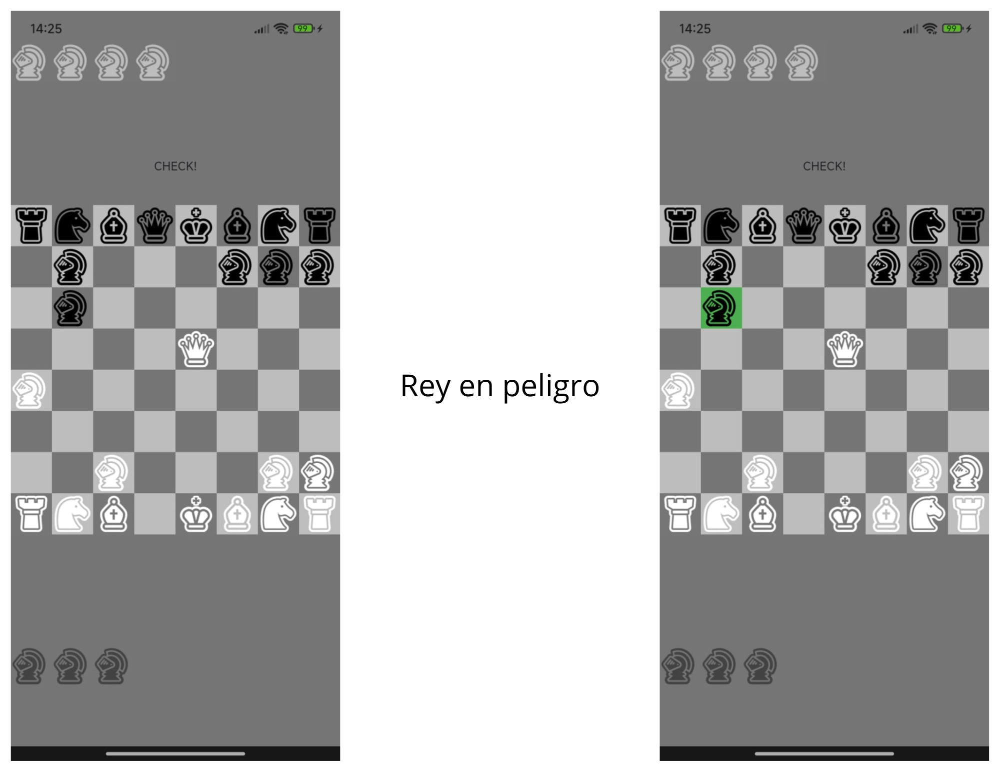
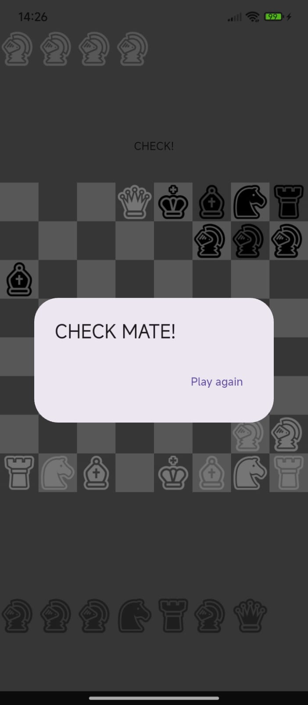

# Chess Game

Proyecto creado para la materia "Programación de Aplicaciones Móviles"

## Sobre el Proyecto

Este proyecto fue creado para introducir al estudiante en la programación móvil, por lo que no cuenta con base de datos, API's, integraciones complejas, etc.

  

En esta primera imagen, podemos observar, que al igual que el juego tradicional de ajedréz es por turnos, en donde primero mueven las piezas blancas y posteriormente las negras

  

En esta segunda imagen, podemos apreciar lo que pasa cuando uno de los reyes se encuentra en peligro, en este caso lo está el rey negro, por lo que no nos deja mover otra pieza que no asegure la integridad del rey

  

En esta tercera imagen, observamos que al caer uno de los dos reyes, que en esta caso es el rey negro, termina el juego y nos da la opción de jugar una nueva partida

<video src="demostración.mp4" width="400" controls>
  Tu navegador no soporta el elemento de video.
</video>

A diferencia del ajedréz común, en este mini-game, cuando un peón llega al otro lado del tablero, automáticamente se convierte en una reina, dando libertad a moverse por el tablero como si fuera una
